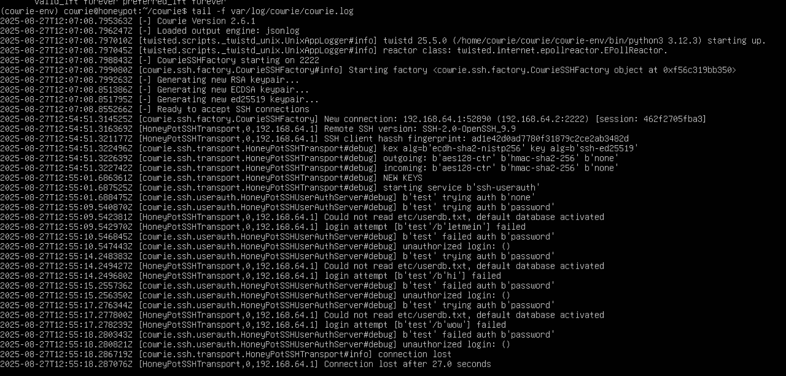

### Cowrie SSH/Telnet Honeypot  

### 🔎 Overview  
This project sets up a **Cowrie** honeypot (fake SSH/Telnet server) to observe attacker behavior. I show how raw logs become analyst-friendly tables, add a real detection rule for brute force, and include a small SOC playbook for triage and escalation decisions.

### Architecture / Data Flow

```mermaid
flowchart TD
A["Internet Attacker"] -->|SSH/Telnet| B["Cowrie VM"];
subgraph Lab
  B
  C["cowrie.json (raw logs)"]
  O["run.sh → events.csv & top_attackers.csv"]
end
B --> C;
C --> D["Agent/Filebeat (ship logs)"];
D --> E["SIEM (Elastic / Splunk / Sentinel)"];

%% Detections with explicit severity
E --> R1["Rule: ≥10 failed SSH in 5m by src_ip (SEV: MEDIUM)"];
E --> R2["Rule: any login SUCCESS to Cowrie (SEV: HIGH)"];

R1 --> F["Alert"];
R2 --> F;

%% Enrichment step (real SOC behavior)
F --> X["Enrichment: whois / IP reputation / geo"];
X --> G["Triage: check success & commands; correlate artifacts"];

%% Decisions & outcomes
G --> H{"Decision"};
H -->|Contain| I["Block IP (lab)"];
H -->|Escalate| J["Escalate to SOC2 / IR Team\n(Create ticket in Jira/ServiceNow)"];
H -->|Close/Tune| K["Adjust threshold / whitelist known scanner"];
```

### Detection & Response

**What I detect**
- **R1 (MED):** ≥10 failed SSH logins from the same `src_ip` within 5 minutes (brute-force threshold)
- **R2 (HIGH):** any successful login to the Cowrie honeypot

**Portable rules (Sigma)**
- Threshold rule: [`detections/ssh_bruteforce_sigma.yml`](detections/ssh_bruteforce_sigma.yml)
- Success rule:   [`detections/ssh_success_sigma.yml`](detections/ssh_success_sigma.yml)

<details>
<summary><strong>Elastic (KQL)</strong> — create a Threshold rule</summary>

**R1 (threshold)**
- Query:  
  `eventid: "cowrie.login.failed"`
- Threshold: **by `src_ip` ≥ 10** in **5 minutes**

**R2 (scheduled query)**
- Query:  
  `eventid: "cowrie.login.success"`
</details>

<details>
<summary><strong>Splunk (SPL)</strong></summary>

**R1 (threshold)**
```splunk
index=cowrie eventid="cowrie.login.failed"
| bucket _time span=5m
| stats count by _time, src_ip
| where count >= 10
```
Threshold: by src_ip ≥ 10 in 5 minutes

R2 (success)
Query:
eventid: "cowrie.login.success"
</details> <details> <summary><strong>Splunk (SPL)</strong></summary>

R1 (threshold)
index=cowrie eventid="cowrie.login.failed"
| bucket _time span=5m
| stats count by _time, src_ip
| where count >= 10

R2 (success)
index=cowrie eventid="cowrie.login.success"
</details> <details> <summary><strong>Splunk (SPL)</strong></summary>

R1 (threshold)
index=cowrie eventid="cowrie.login.failed"
| bucket _time span=5m
| stats count by _time, src_ip
| where count >= 10

R2 (success)
index=cowrie eventid="cowrie.login.success"
</details> <details> <summary><strong>Microsoft Sentinel (KQL)</strong></summary>

R1 (threshold)
Cowrie_CL
```
| where eventid_s == "cowrie.login.failed"
| summarize cnt=count() by src_ip=src_ip_s, bin(TimeGenerated, 5m)
| where cnt >= 10
```

R2 (success)
Cowrie_CL
| where eventid_s == "cowrie.login.success"
</details>

**How I respond:** see [PLAYBOOK.md](PLAYBOOK.md)

---


### 🛠️ Environment Setup  

- **Host Machine:** macOS (Apple Silicon)  
- **Virtualization:** [UTM](https://mac.getutm.app/) (QEMU-based hypervisor for ARM)  
- **Guest OS:** Ubuntu 24.04 LTS (ARM64)  
- **Honeypot Software:** Cowrie (Python3-based)  

---

### ⚙️ Installation Steps  

#### 1. System Update  
After installing Ubuntu, updated and upgraded system packages:  

```bash
sudo apt update && sudo apt upgrade -y
```


#### 2. Install Required Dependencies  

Cowrie requires Python3, Git, and several supporting libraries.  

```bash
sudo apt install -y git python3 python3-venv python3-dev libssl-dev libffi-dev build-essential authbind less
```


#### 3. Create a Dedicated User for Cowrie

Create a non-privileged user account for running Cowrie:

```bash
sudo adduser --disabled-password cowrie
```
You will be prompted to enter user details (Full Name, Room Number, etc.).
Press ENTER to accept the defaults, or enter placeholder values if you prefer.


#### 4. Clone the Cowrie Repository  

Switch to the `cowrie` user and clone the official Cowrie repository from GitHub:  

```bash
su - cowrie
git clone https://github.com/cowrie/cowrie.git
cd cowrie
```
 

#### 5. Create and Activate Python Virtual Environment  

Cowrie should be installed inside a virtual environment to keep dependencies isolated.  

```bash
python3 -m venv cowrie-env
source cowrie-env/bin/activate
```


#### 6. Install Python Dependencies

Cowrie requires several Python libraries. Install all dependencies listed in the `requirements.txt` file:

```bash
pip install --upgrade pip
pip install -r requirements.txt
```
After installation, verify the packages with:
```
pip list
```
 

#### 7. Configure Cowrie

Copy the default configuration file to create your own working `cowrie.cfg` file:

```bash
cp etc/cowrie.cfg.dist etc/cowrie.cfg
```
Verify the file exists in the etc/ directory:
```
ls -la etc/
```


#### 8. Start and Verify Cowrie

Start the Cowrie honeypot using the provided script:

```bash
bin/cowrie start
```
Then check its status to confirm it is running:
```
bin/cowrie status
```


#### 9. Monitor Cowrie Logs

Cowrie stores logs in the `var/log/cowrie/` directory. These logs capture all SSH/Telnet connection attempts, authentication attempts, and commands executed by attackers.

List the contents of the log directory:

```bash
ls -la var/log/cowrie/
```
Then use tail -f to monitor the log file in real-time:
```
tail -f var/log/cowrie/cowrie.log
```


#### 10. Simulate Attack Attempts

To validate that Cowrie is functioning, attempt to connect via SSH.  
Remember, Cowrie listens on **port 2222** by default, not the standard port 22. 

```bash
ssh test@192.168.x.x -p 2222
```


When testing, you will see failed login attempts captured in the logs. This confirms that the honeypot is intercepting and recording activity exactly as expected.
In a real-world deployment, attackers scanning your network would hit this service, allowing you to analyze their behavior in a safe and controlled environment.

