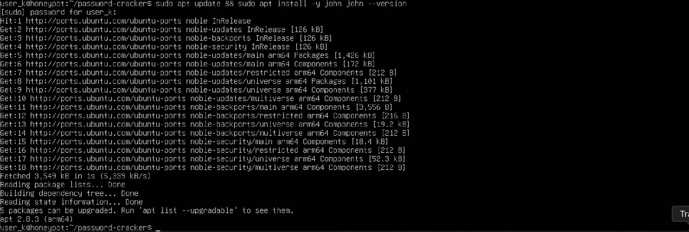
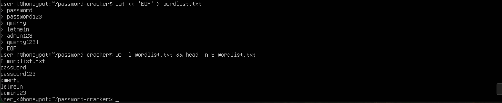
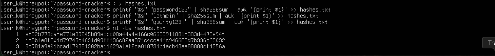

### Password Cracker with John the Ripper

---

### 🔎 Overview
This project demonstrates the use of **John the Ripper**, an industry-standard password cracking tool, to highlight the risks of weak passwords.  
By simulating a small cracking exercise inside a controlled environment, I show how attackers can recover plaintext passwords from hashes when weak wordlists are used.  

This lab reinforces the importance of strong password policies, salted/slow hashing algorithms, and multi-factor authentication.

---

### 🖥️ Environment Setup
- **Host Machine:** macOS (Apple Silicon)  
- **Virtualization:** UTM (QEMU-based hypervisor for ARM)  
- **Guest OS:** Ubuntu 24.04 LTS (ARM64)  
- **Tool Used:** John the Ripper  

---

### ⚙️ Lab Steps

### Step 1 — Install John the Ripper
```bash
sudo apt update && sudo apt install -y john
john --version
```


### Step 2 — Create a Small Wordlist

**Why we do this:**  
Attackers rarely guess passwords randomly. Instead, they rely on *wordlists* — collections of the most common passwords people use.  
For this lab, I created a **tiny custom wordlist** with just a few weak examples to simulate this process.

**Command:**
```bash
cat << 'EOF' > wordlist.txt
password
Password123
qwerty
letmein
admin123
Qwerty123!
EOF

# Quick check
wc -l wordlist.txt && head -n 5 wordlist.txt
```


### Step 3 — Generate SHA-256 Hashes

**Why we do this:**  
Systems don’t store plain-text passwords; they store **hashes**. A hash is a one-way transformation of a password.  
Attackers don’t “reverse” hashes — instead, they hash guesses from a wordlist and compare results.  
Here, I generated SHA-256 hashes for three weak test passwords (`Password123`, `letmein`, `Qwerty123!`) that also exist in my wordlist.

**Commands I ran:**
```bash
# Create a test password file
cat << 'EOF' > to_hash.txt
Password123
letmein
Qwerty123!
EOF

# Confirm the file
cat to_hash.txt

# Generate and save hashes into hashes.txt
: > hashes.txt
printf "%s" "Password123" | sha256sum | awk '{print $1}' >> hashes.txt
printf "%s" "letmein"     | sha256sum | awk '{print $1}' >> hashes.txt
printf "%s" "Qwerty123!"  | sha256sum | awk '{print $1}' >> hashes.txt

# Display hashes with line numbers
nl -ba hashes.txt
```


### Step 4 — Crack Hashes with John the Ripper

**Why we do this:**  
John the Ripper tests each word from our custom wordlist by hashing it with SHA-256 and comparing the result to the hashes in `hashes.txt`.  
If a match is found, the original password is recovered. This simulates how attackers perform offline brute-force or dictionary attacks against stolen hash databases.

**Commands I ran:**
```bash
# Crack the hashes using our wordlist
/snap/bin/john-the-ripper --format=Raw-SHA256 --wordlist=wordlist.txt hashes.txt

# Show the cracked passwords in a clean summary
/snap/bin/john-the-ripper --show --format=Raw-SHA256 hashes.txt
```


